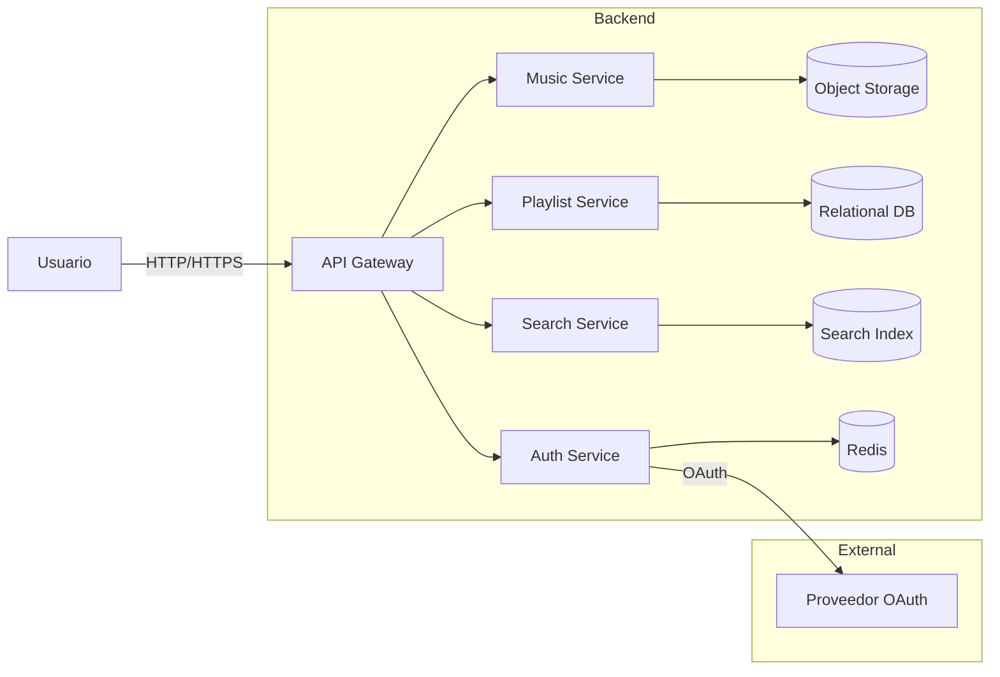

# Arquitectura - Visión General

> Esta es una vista de alto nivel (C4 - Contexto/Contenedores) del sistema.

## Decisiones clave
- Microservicios por dominio (Auth, Música, Playlists, Búsqueda)
- Event-driven para sincronizar metadatos musicales
- Base relacional para playlists (consistencia) y almacenamiento de objetos para media

Consulta las [ADRs](decisiones/README.md) para el detalle.