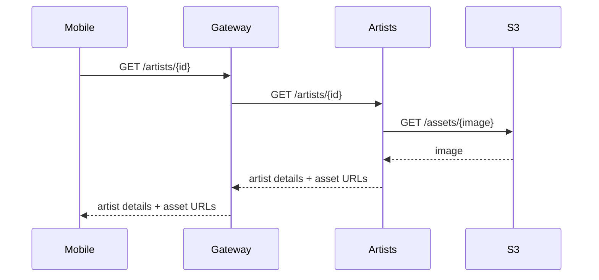
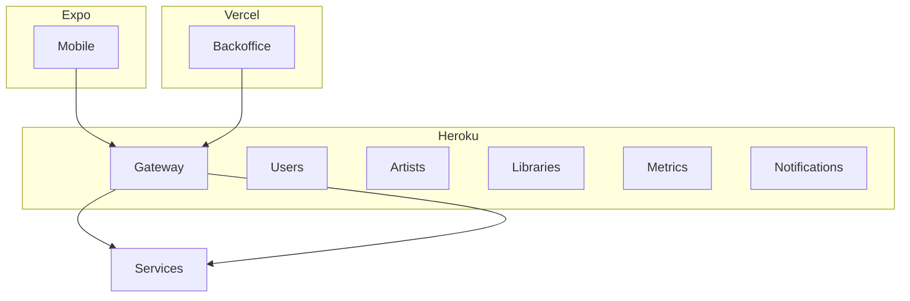

# Diagramas de Arquitectura

En esta sección se muestran diagramas de alto nivel que ilustran cómo interactúan los componentes del sistema.

## Diagrama general (Componentes)

```mermaid
flowchart LR
  subgraph Frontends
    Mobile[Frontend Móvil (Expo)]
    Backoffice[Backoffice web (Vite/React)]
  end

  subgraph Infra
    Gateway[Gateway (Node.js)]
    S3[(Almacenamiento S3 / LocalStack)]
  end

  subgraph Services
    Users[Users Service]
    Artists[Artists Service]
    Libraries[Libraries Service]
    Metrics[Metrics Service]
    Notifications[Notifications Service]
  end

  Mobile -->|HTTP/REST| Gateway
  Backoffice -->|HTTP/REST| Gateway
  Gateway -->|Enrutamiento| Users
  Gateway -->|Enrutamiento| Artists
  Gateway -->|Enrutamiento| Libraries
  Gateway -->|Enrutamiento| Metrics
  Gateway -->|Enrutamiento| Notifications
  Artists -- S3 --> S3
  Libraries -- S3 --> S3
```

## Diagrama de secuencia (Solicitud de reproducción / detalle de artista)



## Diagrama de despliegue (alto nivel)



Estos diagramas son conceptuales y facilitan la comprensión de la arquitectura. Para detalles concretos de despliegue (tamaños de instancia, variables de entorno y secretos), consultar los README de cada microservicio y la configuración de Heroku/Vercel.

